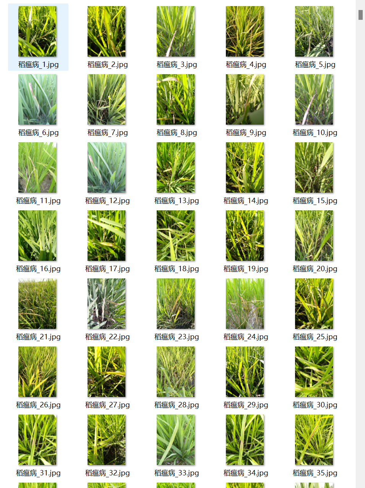
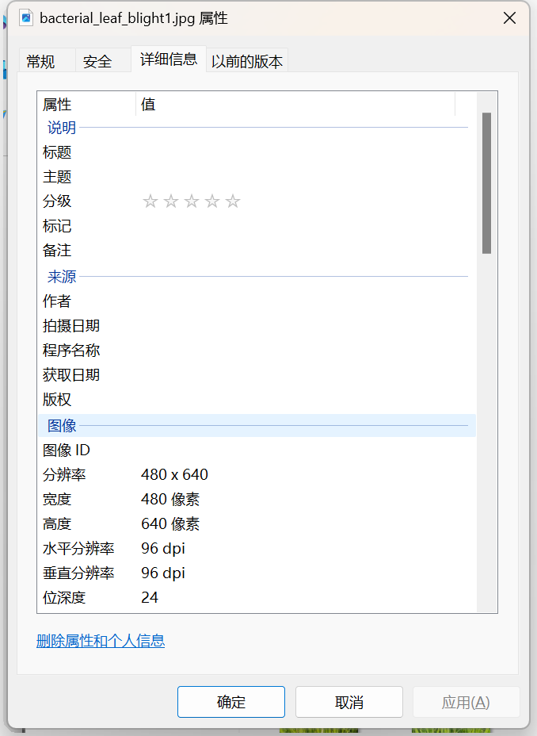

# Rice Disease Image Classification Dataset

**Complete Dataset Introduction:**
- The number of images in the folder "E.g., Dongguan Guanjie Virus Disease" is 1088.
- The number of images in the folder "Healthy Rice" is 1764.
- The number of images in the folder "Bulb Rot" is 1442.
- The number of images in the folder "Rice Blast" is 1738.
- The number of images in the folder "Bacterial Striped Wilt" is 380.
- The number of images in the folder "Bacterial Blight" is 479.
- The number of images in the folder "Bacterial Sheath Blight" is 337.
- The number of images in the folder "Brown Spot" is 965.
- The number of images in the folder "Downy Mildew" is 620.
The total number of images in all subfolders: 8813.

**Overall Preview:**
- 
- **Image Resolution:**

## Images

Here is a pay link on Stripe ( https://buy.stripe.com/3cs8yP7sY87d0vu9AB ). Please contact me lonlonago@foxmail.com after funding $89, and I will send you a complete data files , thank you!

